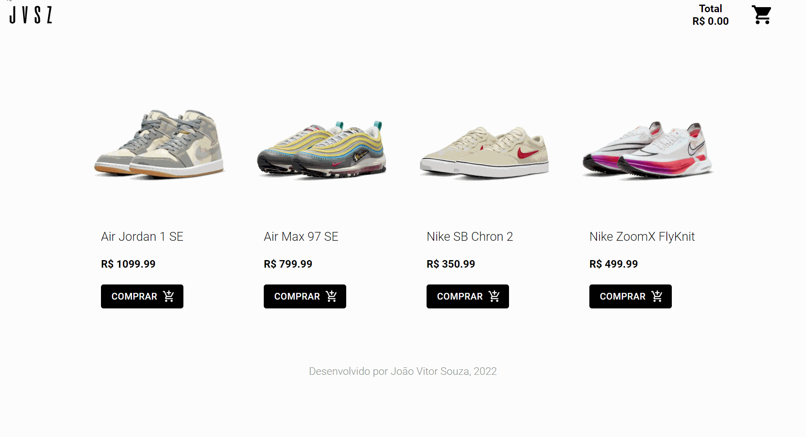

<h1 align="center">
  Cart-App
</h1>

  <a href="#-tecnologias">Tecnologias</a>&nbsp;&nbsp;&nbsp;|&nbsp;&nbsp;&nbsp;
  <a href="#-projeto">Projeto</a>&nbsp;&nbsp;&nbsp;|&nbsp;&nbsp;&nbsp;
  <a href="#-layout">Layout</a>&nbsp;&nbsp;&nbsp;

## 🚀 Tecnologias

Esse projeto foi desenvolvido com as seguintes tecnologias:

- ReactJs
- ViteJs
- Material UI
- CSS
- JavaScript

## 💻 Projeto

O Cart-App é uma aplicação desenvolvida  com React com intuito de fazer uma pequena demonstração de como seria a interação de  um usuário dentro de um site de compras ao adicionar os produtos escolhidos em um carrinho. Este app tem como principal demonstração de código a utilização de componentes dinâmicos e o compartilhamento de estado utilizando um gerenciador, o Context API, que resolve um antigo problema, o  Prop Drilling.

## 🔖 Demonstração

---

Feito com ♥ by JoãoVitor :wave: [Fala comigo!](mailto:joaovitor1713coin@gmail.com)
